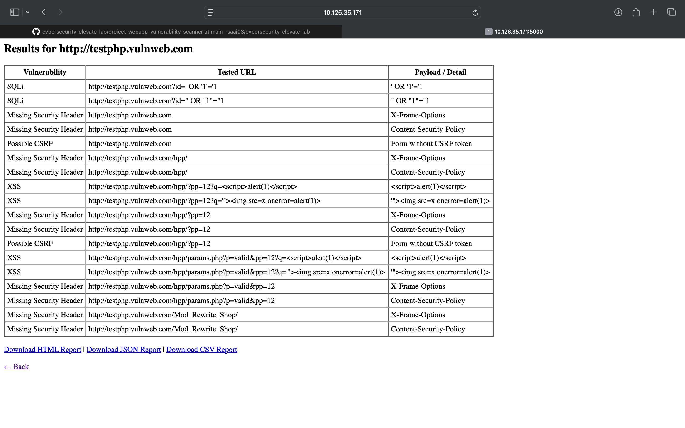

# 🔎 WebApp Vulnerability Scanner
A lightweight Python-based vulnerability scanner that can detect common web application security issues.  
It provides both a **command-line interface (CLI)** and a **Flask-based web interface** to perform scans and generate reports.

---

## ✨ Features
- Detects common vulnerabilities:
  - SQL Injection (SQLi)
  - Cross-Site Scripting (XSS)
  - Cross-Site Request Forgery (CSRF)
  - Missing Security Headers
- Generates reports in:
  - **HTML**
  - **CSV**
  - **JSON**
- Supports both CLI and Web Interface
- Easy to extend with new vulnerability checks

---

## 📸 Example Scan Output

Here’s an example scan result against a test website:



---

## 🚀 Installation

1. **Clone the repository**
   ```bash
   git clone https://github.com/YOUR-USERNAME/project-webapp-vulnerability-scanner.git
   cd project-webapp-vulnerability-scanner
    ```
 2. **Create a virtual environment** (optional but recommended)
```bash
python3 -m venv venv
source venv/bin/activate   # On Linux/Mac
venv\Scripts\activate      # On Windows
```
3. **Install dependencies
```bash
pip install -r requirements.txt
```

___ 

## ▶ Usage
**Run Scanner in CLI Mode
```bash
python3 scanner.py
```
1.Enter a target URL when prompted.

2.Results will be displayed in the terminal and saved in the reports/ folder:

- reports/report.json

- reports/report.csv

- reports/report.html
___

## Run Flask Web Interface
```bash
python3 app.py
```
1.Visit http://127.0.0.1:5000
 in your browser.

2.Enter the target URL in the web form.

3.Reports can be downloaded in multiple formats (JSON, CSV, HTML).

---
