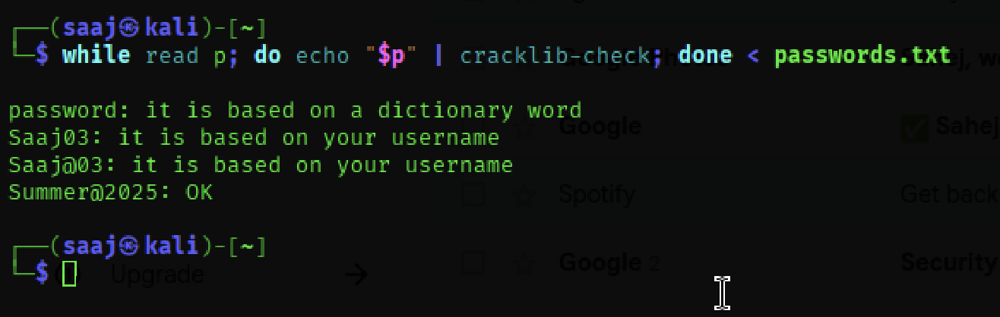
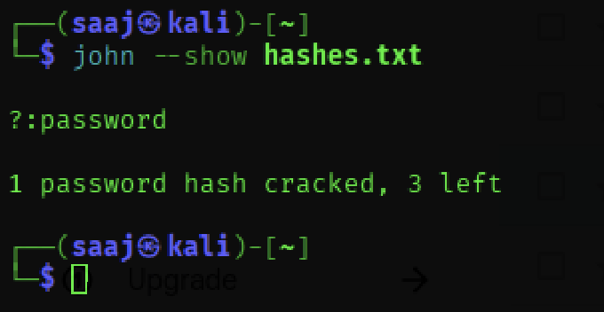

## **Objectives**
- Understand what makes a password strong.
- Create multiple passwords with varying complexity.
- Test passwords using **online** and **offline** tools.
- Analyze feedback and crack times.
- Demonstrate dictionary-based password attacks.

---

### **1. Online Password Strength Checker (passwordmeter.com)**

#### **8% Score**
**Password:** `password`  
- Common, dictionary-based password.  
- Extremely weak and easily cracked.

#### **50% Score** 
**Password:** `Saaj03`  
- Contains uppercase, lowercase, and numbers.  
- Too short and lacks special symbols.  
- Rated **Good** but still vulnerable.

#### **76% Score**
**Password:** `Saaj@03`  
- Includes uppercase, lowercase, number, and symbol.  
- Slightly longer but still under optimal length.  
- Rated **Strong**.

#### **100% Score**
**Password:** `Summer@2025`  
- Meets all requirements (length, variety, randomness).  
- Rated **Very Strong**.


---

### **2. cracklib-check (Kali Linux)**
  
- `Saaj03` → Based on username, weak.  
- `Saaj@03` → Based on username, weak.  
- `Summer@2025` → OK.  
- `password` → Too short and in dictionary.

---

### **3. John the Ripper – Dictionary Attack**
  
- Used `rockyou.txt` dictionary.  
- **Cracked instantly**: `password` (<1 sec).  
- Others remained uncracked (not in dictionary).

---

## **Summary Table**

| Password       | Online Score | Complexity  | cracklib-check Result          | Cracked by Dictionary? |
|----------------|-------------|-------------|--------------------------------|------------------------|
| password       | 8%          | Very Weak   | Dictionary word                | Yes                 |
| Saaj03         | 50%         | Good        | Based on username              | No                  |
| Saaj@03        | 76%         | Strong      | Based on username              | No                  |
| Summer@2025    | 100%        | Very Strong | OK                             | No                  |

---

## **Tools Used**
- **Online:** [passwordmeter.com](https://passwordmeter.com)
- **Offline (Kali Linux):**
  - `cracklib-check`
  - `john` (John the Ripper) with `rockyou.txt`

---
## Commands Used
```bash
# Update package lists
sudo apt update

# Install cracklib-check, John the Ripper, whois (for mkpasswd), and wordlists
sudo apt install -y libpam-cracklib john whois wordlists

# Decompress rockyou wordlist if needed
sudo gzip -d /usr/share/wordlists/rockyou.txt.gz

# Check password strength using cracklib-check (reads from passwords.txt)
while read -r p; do echo "$p" | cracklib-check; done < passwords.txt

# Generate SHA-512 password hashes from passwords.txt
while read -r p; do mkpasswd -m sha-512 "$p"; done < passwords.txt > hashes.txt

# Run John the Ripper with rockyou wordlist to attempt cracking
john --wordlist=/usr/share/wordlists/rockyou.txt hashes.txt
```
---

# OBSERVATIONS:
 - Weak/common passwords (e.g., "password", "123456") are instantly cracked by dictionary attacks.
 - Username-based passwords (e.g., "Saaj03") are weak even if they include numbers/symbols.
 - Longer passwords with mixed character sets (uppercase, lowercase, digits, symbols) resist dictionary attacks.
 - cracklib-check flags passwords based on dictionary/username patterns; John the Ripper finds passwords present in wordlists.

---

# CONCLUSION:
 - Use unique, long (12+ chars), mixed-character passwords or passphrases.
 - Avoid dictionary words, usernames, or personal info.
 - Test locally (cracklib-check) and with controlled dictionary attacks to demonstrate weaknesses.
 - For production use, rely on password managers and enable MFA instead of memorizing complex passwords.

---

